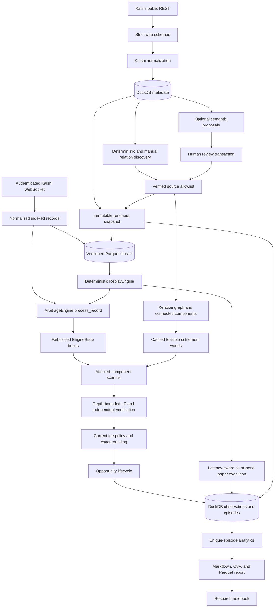

# Arbiter Architecture

Arbiter is an intra-venue research and paper-execution system for structural and
combinatorial arbitrage on Kalshi. Its central boundary is deliberate: sourced logical
relations define feasible settlement worlds, executable order-book levels define bounded
instruments, and a generic linear program searches for a portfolio with positive profit in
every feasible world. No module submits a real order.

This document describes the implementation through Milestone 11. Schema details live in
[DATA_MODEL.md](DATA_MODEL.md), and the optimization is derived in [MATH.md](MATH.md).

## End-to-end data flow

Two storage paths are intentional. High-volume ordered market-data and control records go to
Parquet. Queryable metadata, run manifests, opportunity transitions, and paper-execution
evidence go to DuckDB. The immutable run-start payload connects the two.

## Metadata and exchange boundary

[`kalshi/schemas.py`](../src/arbiter/kalshi/schemas.py) accepts documented Kalshi REST and
WebSocket shapes while retaining unknown additive exchange fields. Exchange-specific parsing
stays in [`kalshi/normalize.py`](../src/arbiter/kalshi/normalize.py). It converts fixed-point
price and quantity strings directly to `Decimal`, validates tick ranges, and normalizes the
WebSocket's unified YES-price convention exactly once.

[`kalshi/client.py`](../src/arbiter/kalshi/client.py) owns bounded public REST requests,
pagination, market/event/series ancestry, order-book snapshots, and event fee schedules.
[`kalshi/auth.py`](../src/arbiter/kalshi/auth.py) signs authenticated WebSocket requests without
exposing key material. [`kalshi/websocket.py`](../src/arbiter/kalshi/websocket.py) owns the
connection state machine, finite queues, reconnect policy, subscription commands, lifecycle
notifications, and normalized records. Nothing below this boundary consumes raw exchange
payloads.

## Relation trust boundary

Relations may originate from four production provenance labels:

- `exchange_declared` for an explicit exchange relationship;
- `threshold_deterministic` for compatible strike nesting;
- `manual` for a reviewed local relation file;
- `semantic_verified` for a separately reviewed semantic suggestion.

[`relations/deterministic.py`](../src/arbiter/relations/deterministic.py),
[`relations/thresholds.py`](../src/arbiter/relations/thresholds.py), and
[`relations/manual.py`](../src/arbiter/relations/manual.py) create the non-semantic forms.
[`relations/validator.py`](../src/arbiter/relations/validator.py) rejects malformed relations,
unknown markets, duplicate semantics, impossible worlds, oversized components, and verified
rows whose source is outside the allowlist.

[`relations/semantic.py`](../src/arbiter/relations/semantic.py) is a proposal system, not a
solver. It builds hash-addressed rule and timing evidence, applies compatibility filters,
retrieves local embedding neighbors, and parses an optional classifier through a strict JSON
schema. Raw and parsed output, provider/model identity, prompt version, confidence, rationale,
and exact evidence are stored in separate semantic tables. Approval rechecks current persisted
metadata and creates a `semantic_verified` relation in the same transaction. Reject and
uncertain actions create no trusted relation. A rule or timing change makes prior approval stale
and de-verifies its projection.

[`relations/trust.py`](../src/arbiter/relations/trust.py) is the final policy gate. Confidence
never grants trust: a relation must be both verified and exactly allowlisted.
[`relations/graph.py`](../src/arbiter/relations/graph.py) filters through that gate before it
forms connected components. Consequently, an unreviewed model result is not a feasible-world
constraint.

## Logic and optimization core

The core is exchange-agnostic:

1. [`logic/compiler.py`](../src/arbiter/logic/compiler.py) translates `IMPLIES`, `EQUIVALENT`,
   `MUTUALLY_EXCLUSIVE`, and `EXACTLY_ONE` records into explicit logical constraints.
2. [`logic/worlds.py`](../src/arbiter/logic/worlds.py) exhaustively enumerates feasible binary
   settlements for each small connected component and caches them by relation fingerprint.
3. [`solver/instruments.py`](../src/arbiter/solver/instruments.py) turns real complementary bid
   levels into bounded YES/NO purchase instruments. Missing, empty, stale, future-dated, or
   resynchronizing books reject the whole component.
4. [`solver/payoff.py`](../src/arbiter/solver/payoff.py) creates state-contingent payoff columns.
5. [`solver/lp.py`](../src/arbiter/solver/lp.py) maximizes minimum profit subject to displayed
   depth and optional capital limits, snaps quantities down to the supported grid, and applies
   a stable minimum-cost tie-break.
6. [`solver/diagnostics.py`](../src/arbiter/solver/diagnostics.py) independently recomputes cost,
   state payouts, constraints, and the worst-case guarantee with `Decimal` before a result can
   be called executable.
7. [`solver/fees.py`](../src/arbiter/solver/fees.py) resolves dated event overrides over series
   defaults and applies the documented fee formula and order-level rounding ledger. Unknown or
   inconsistent fee metadata fails closed at gross-only evidence.

The configured component bound is 12 markets. Exhaustive worlds are transparent and appropriate
at that scale; Arbiter does not disguise a large combinatorial search behind the LP.

## Stateful engine and opportunity lifecycle

[`engine/state.py`](../src/arbiter/engine/state.py) owns normalized metadata, trusted components,
cached worlds, subscription membership, order books, and fee readiness. Sequence continuity is
isolated behind `SequenceTracker`; a gap, conflicting duplicate, out-of-order record, or
ambiguous connection state latches the affected books unusable until an explicit replacement
snapshot.

[`engine/scanner.py`](../src/arbiter/engine/scanner.py) has three distinct responsibilities:

- `ComponentScanner` evaluates one component from an explicit event time. It records a fresh
  two-sided midpoint diagnostic, a one-contract spread and fee probe, the actual depth-constrained
  optimum, and its fee-adjusted result.
- `OpportunityLifecycle` turns those decisions into deterministic `OPEN`, `UPDATED`, `CLOSED`,
  and `RIGHT_CENSORED` episode transitions. Persistence succeeds before in-memory state advances.
- `ArbitrageEngine` applies records, identifies affected components, and runs per-component
  debounce timers in event time rather than wall time.

[`engine/live.py`](../src/arbiter/engine/live.py) composes these pieces. It subscribes only to
markets in trusted active components, appends each indexed record before applying it, records
fresh/stale/resynchronization windows, persists scanner output, refreshes authoritative metadata
when required, and finalizes a hash-bound run manifest. Persistent Parquet or DuckDB failure is a
run failure, never permission to continue with an unrecorded decision.

## Recorded stream and replay

[`replay/events.py`](../src/arbiter/replay/events.py) defines strict normalized book records and
schema-v2 control records. A self-contained scan stream begins with `RunStartedEvent`, including
canonical non-secret configuration, metadata, relations, and fee-policy inputs. It also records
subscription, disconnect, staleness, metadata/fee refresh, and terminal boundaries. The stream's
SHA-256 hashes each canonical event preceded by its eight-byte big-endian length.

[`storage/parquet.py`](../src/arbiter/storage/parquet.py) writes the authoritative contiguous
`event_index` order into date-partitioned zstd Parquet. A nonblocking writer lease prevents two
collectors from appending overlapping indexes. The reader rejects gaps, duplicates, schema
mixing, bad partitions, and malformed row unions.

[`replay/engine.py`](../src/arbiter/replay/engine.py) validates one complete run and reconstructs
state only from its run-start inputs. Replay calls the same `ArbitrageEngine.process_record`
method as live scanning. Playback speed changes sleeping only. Records sharing a timestamp are
processed in index order before timers due at that timestamp; timers strictly earlier than the
next record fire first.

Every Stage-2 `OPEN` or `UPDATED` replay observation schedules a paper attempt.
[`engine/paper_execution.py`](../src/arbiter/engine/paper_execution.py) waits in event time, then
tests the fixed requested legs against the books and fee policy current at the deadline. All legs
survive or the whole attempt fails; no partial portfolio is claimed. Coverage ending before the
deadline is `insufficient_future_data`, and an episode still active at run end is right-censored
rather than assigned a fabricated close.

## Persistence boundaries

[`storage/duckdb.py`](../src/arbiter/storage/duckdb.py) is the transactional repository for:

- normalized markets, events, series, and fee schedules;
- trusted relations plus isolated semantic embeddings and suggestions;
- immutable live/replay run inputs and stream provenance;
- fresh-book observation windows;
- opportunity summaries, every scanner observation, and exact portfolio legs;
- paper attempts, expected and actual fills, fee policies, and outcomes.

[`storage/migrations.py`](../src/arbiter/storage/migrations.py) applies append-only schema versions.
Opportunity transitions and their summary updates share one transaction. Semantic approval and
its trusted projection share another. Retry is finite and limited to classified transient
DuckDB errors.

## Research analytics boundary

[`analytics/metrics.py`](../src/arbiter/analytics/metrics.py) reduces immutable run and observation
rows into one fact per opportunity episode. It selects one economic projection per source
recording, uses the source live run for event-time market coverage, preserves closed versus
right-censored durations, and aggregates repeated paper attempts without treating missing future
coverage as failure. Fixed funnel and settlement-bucket definitions live in this pure layer.

[`analytics/report.py`](../src/arbiter/analytics/report.py) is the DuckDB and artifact boundary. It
loads historical observation snapshots rather than joining to mutable present-day catalog rows,
then emits Markdown, CSV, and Parquet with deterministic ordering. The tracked
[fixture report](fixture-report/report.md) demonstrates the schema; the
[`research.ipynb`](../notebooks/research.ipynb) notebook reads those products without duplicating
the production reducer. Statistical definitions and interpretation limits live in
[RESEARCH.md](RESEARCH.md).

## Safety and reproducibility invariants

- There is no order-submission path and no real-money execution mode.
- Kalshi-specific wire behavior ends at the normalization boundary.
- Money-facing values remain `Decimal`; numerical results are independently repriced.
- Only verified, allowlisted relations constrain settlement worlds.
- Known-stale or ambiguous books cannot generate executable opportunities.
- Event time and `event_index` determine decisions; wall time and replay speed do not.
- Run manifests bind decisions to exact non-secret inputs and recorded-stream identity.
- Multi-leg paper execution is explicitly non-atomic and all-or-none only as a simulation.
- A bounded run ending is censoring, not evidence that an opportunity disappeared.

The research methodology built on these records is defined in [RESEARCH.md](RESEARCH.md).
